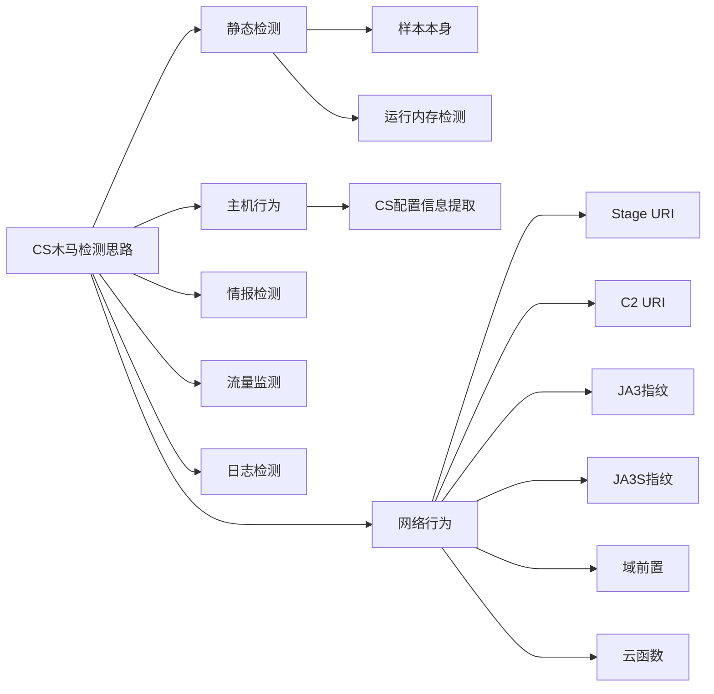

## CS简介
------------------
CobaltStrike是一款渗透测试神器，被业界人称为CS神器。CobaltStrike分为客户端与服务端，服务端是一个，客户端可以有多个，可被团队进行分布式协团操作。
CobaltStrike集成了端口转发、服务扫描，自动化溢出，多模式端口监听，windows exe 木马生成，windows dll 木马生成，java 木马生成，office 宏病毒生成，木马捆绑。钓鱼攻击包括：站点克隆，目标信息获取，java 执行，浏览器自动攻击等等强大的功能！

## CS木马检测
------------------
可以借鉴微步云沙箱的检测规则。微步云沙箱是通过6个大类，10个子类的方式划分规则和检测逻辑，对cs进行全链路的检测。具体规则分类如下:

## CS绕过检查手段
-----------------------------------------
本人致力于做笔记，因为记性不好又爱忘。总是希望自己的思路能够更清晰一点，技术能够更有厚重感一点，努力学习，孜孜不倦，希望在这个行业中能够依靠自身努力有一个位置。做一个技术很好的飒姐姐，嘿嘿。

### Cobalt Strike Beacon Staging Server
-----------------------------------------
+ Beacon Staging Server
    + Beacon是什么
        + Beacon是Cobalt Strick运行在目标主机上的payload。Beacon在隐蔽信道上为我们提供服务，用于长期控制受到感染的主机。它的工作方式与Metasploit Framework Payload类似。在实际渗透过程中，我们可以将其添加到可执行文件或word文档或者利用主机漏洞来传递Beacon。
    + Beacon staging Server简析
        + Beacon staging Server的作用是为了防止payload过大或者适用于不同的攻击场景，可以分阶段的进行payload的投递。
        + 首先通过投递一个被称为stager的小巧的payload，然后去Beacon stating server下载体积更为庞大更为复杂的stage，并且访问stage的URL通过cheaksum8进行校验。
    + Stage服务器
        + 当存着Beacon配置和payload的stage服务器在公网时， 默认情况下访问该服务器是会访问到一个伪装的404响应界面。基于这种response的形式，很多空间测绘系统，扫描器等都不能根据response的信息做有效的判断。
        + 需要具体拿到服务器的stage,就必须知道URL的生成算法。这算法来自公开的NES脚本，我们可以使用脚本进行校验码的生成，并且可以根据不同的输入生成32位或64位的payload校验码。
        + 通过拼接校验码到URL，我们便可以直接下载到 Beacon的stage文件，而不是一个404界面。
    + Beacon 解析
        + 2018年,JPcert发布了Volatility(内存取证分析工具)插件cobaltstrikescan用来解析Beacon的配置和payload。
    + C2节点提取与分析
        + 在能够正常解析Beacon的配置文案之后，我们可以看出c2_server字段是C2服务器及其URL的地址。分析可以发下以下几个常见的现象:
            + 绝大多数的C2地址就是Cobalt Strike其自身的ip地址，但是部分C2节点使用了域名进行连接
            + 相同的IP的不同的duan'kou，C2配置节点不同。可以利用该现象找到C2真实ip。也有可能Cobalt Strike配置了多个C2节点。
            + 存在多个Cobalt Strike IP使用相同的C2地址现象。经过分析，可以判定这种情况是Cobalt STRIKE团队服务器有多个ip地址，或者有多个团队服务器。
            + 存在一个Cobalt Strikesh使用不同的C2。
            + 大多数C2节点使用的域名是新的IOC，在VIRUTOTAL等平台中都没有被判黑。

### 域前置
--------------------------------------
+ Domain Fronting
    + 简介：域前置，就是利用CDN进行流量转发，从而绕过IDS的检查。域前置使用户可以在应用层上运作时使用HTTPS连接被屏蔽的服务，而表面上像是在于一个完全不同的站点在通信。
    + 技术原理:在不同通信层使用不同的域名。
        + HTTPS在传输数据之前需要客户端(浏览器)和服务端之间进行一次握手，在握手过程中将确立双方加密传输数据的密码信息。
        + SSL介于应用层和TCP层之间。应用层数据不再直接传递给传输层，而是传输给SSL层，SSL层对应用层收到的数据进行加密，并增加自己的SSL头。
        + 